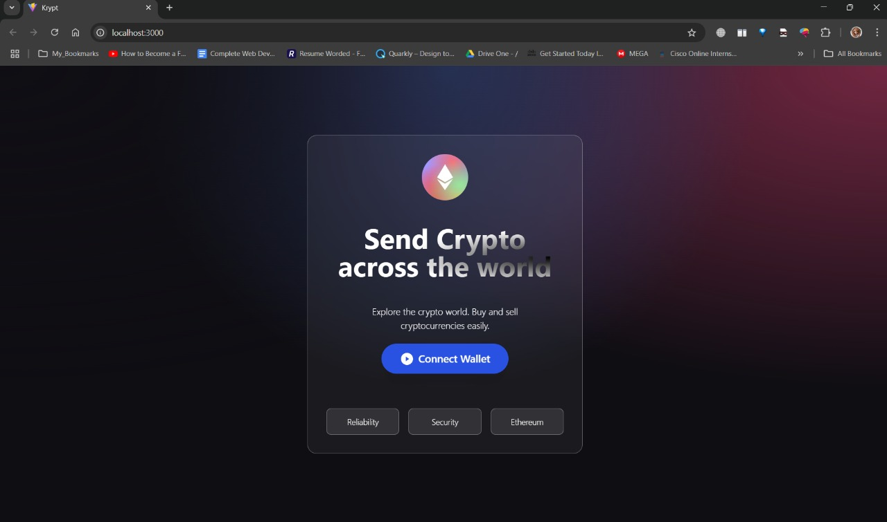
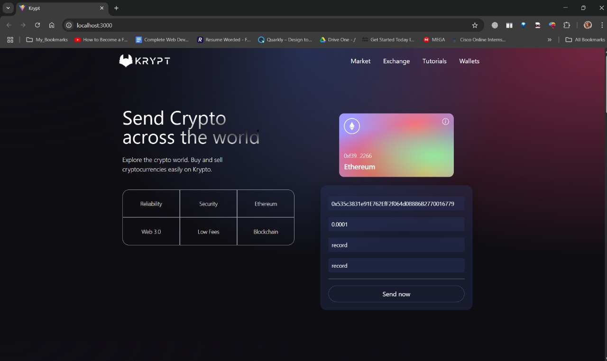
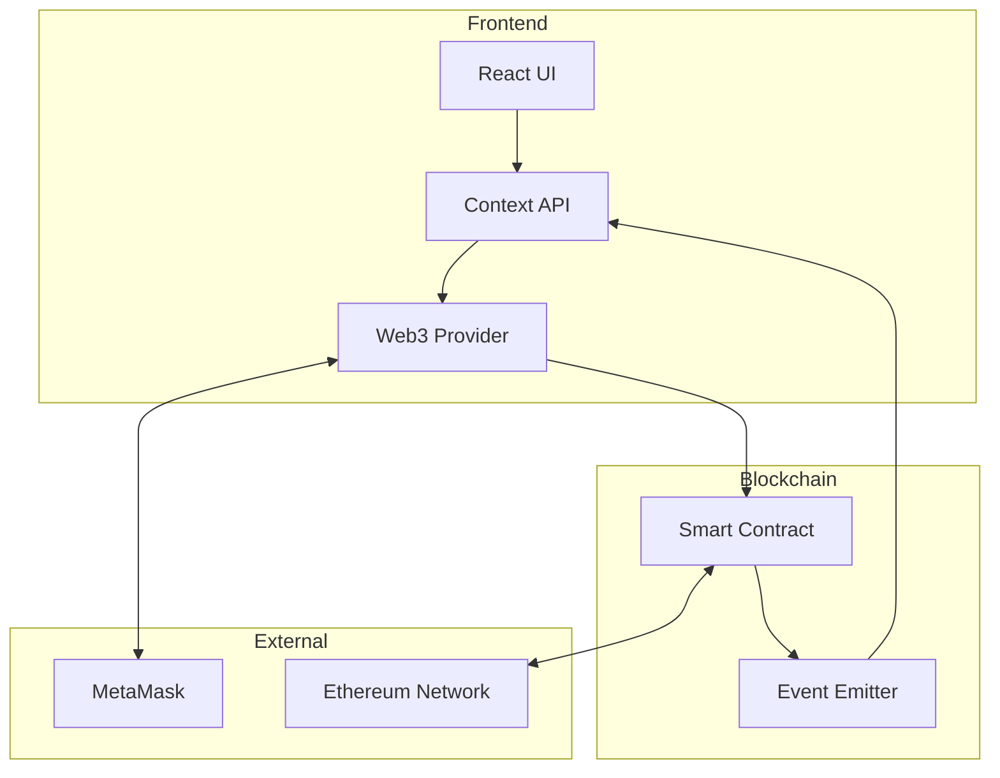
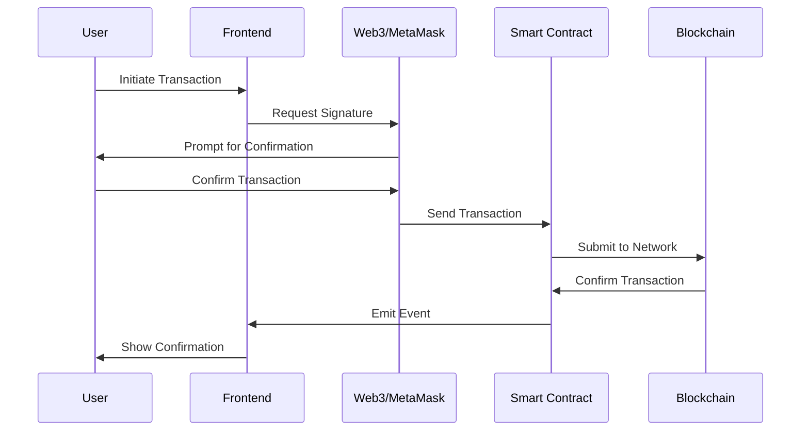
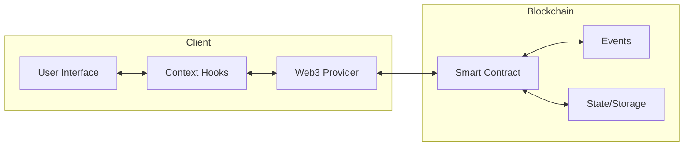
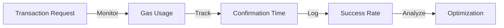

# Web3.0 Blockchain Application

<div align="center">
  
  <h3 align="center">Modern Ethereum Transaction Platform</h3>
</div>

## 📌 Overview

Krypt is a cutting-edge Web3 blockchain application enabling secure Ethereum transactions with real-time processing and transaction history tracking. Built using modern blockchain technologies and a responsive frontend.

<!--  -->

## ✨ Key Features

- **Secure Wallet Integration**: MetaMask wallet connection with multi-account support
- **Smart Contract Transactions**: Send/receive ETH with message attachments
- **Transaction History**: Comprehensive transaction tracking and history
- **Real-time Updates**: Instant transaction status and confirmation
- **Responsive Design**: Seamless experience across all devices
- **Gas Optimization**: Efficient transaction processing with optimal gas usage

## 📸 Screenshots

<div align="center">
  
  <p><em>Secure Login Interface with MetaMask Integration</em></p>

  
  <p><em>Main Dashboard with Transaction Interface</em></p>

  
  <p><em>Transaction History with Detailed Analytics</em></p>
</div>

## 🛠️ Technical Stack

### Frontend
- **React 18**: Latest React features and hooks
- **Vite**: Next-generation frontend tooling
- **TailwindCSS**: Utility-first CSS framework
- **Ethers.js**: Ethereum wallet integration
- **Context API**: State management

### Smart Contracts
- **Solidity ^0.8.0**: Smart contract development
- **Hardhat**: Development environment
- **OpenZeppelin**: Contract security standards
- **Chai**: Testing framework

### Development Tools
- **TypeScript**: Type safety
- **ESLint/Prettier**: Code quality
- **Git**: Version control
- **MetaMask**: Wallet provider

## 🚀 Quick Start

### Prerequisites
- Node.js >= 14.0.0
- MetaMask wallet extension
- Git

### Installation

1. **Clone Repository**
```bash
git clone https://github.com/yourusername/project_web3.0.git
cd project_web3.0
```

2. **Smart Contract Setup**
```bash
cd smart_contract
npm install
npx hardhat compile
npx hardhat node
# In a new terminal
npx hardhat run scripts/deploy.js --network localhost
```

3. **Frontend Setup**
```bash
cd client
npm install
npm run dev
```

## 🌐 Deployment

### Smart Contract Deployment
- **Local**: Use Hardhat Network
- **Testnet**: Supports Goerli, Sepolia
- **Mainnet**: Production deployment

### Frontend Deployment
- **Vercel**: Recommended deployment platform
- **Netlify**: Alternative hosting option
- **GitHub Pages**: For static hosting

Detailed deployment guides in [DEPLOYMENT.md](DEPLOYMENT.md)

## 📊 Project Structure 
```
project_web3.0/
├── client/ # Frontend application
│ ├── src/
│ │ ├── components/ # React components
│ │ ├── context/ # React context
│ │ └── utils/ # Utilities
│ └── public/ # Static files
├── smart_contract/ # Blockchain logic
│ ├── contracts/ # Solidity contracts
│ ├── scripts/ # Deployment scripts
│ └── test/ # Contract tests
└── screenshots/ # Project screenshots
```

## 📊 Technical Architecture

### System Architecture


### Transaction Flow


### Data Flow Architecture


## 🔧 Troubleshooting Guide

### MetaMask Connection Issues

| Issue | Solution |
|-------|----------|
| "No Ethereum provider" | • Install MetaMask<br>• Refresh page<br>• Check if MetaMask is locked |
| "Wrong Network" | • Switch to correct network in MetaMask<br>• Add network if not listed |
| "Account not connected" | • Click 'Connect Wallet'<br>• Approve connection in MetaMask |

### Transaction Errors

| Error | Solution |
|-------|----------|
| "Insufficient funds" | • Check ETH balance<br>• Reduce transaction amount<br>• Account for gas fees |
| "Nonce too high" | • Reset MetaMask account<br>• Clear transaction history<br>• Reconnect wallet |
| "Gas estimation failed" | • Increase gas limit<br>• Check contract state<br>• Verify transaction data |

### Smart Contract Interaction Issues

| Problem | Resolution |
|---------|------------|
| "Contract not deployed" | • Verify contract address<br>• Check network connection<br>• Redeploy if needed |
| "Method not found" | • Check ABI matches contract<br>• Verify method name<br>• Update contract instance |
| "Transaction reverted" | • Check input parameters<br>• Verify contract state<br>• Debug with hardhat |

### Common Error Codes

```typescript
// Error Types and Solutions
const errorSolutions = {
  // MetaMask Errors
  "-32002": "MetaMask is already processing a request",
  "-32603": "Internal JSON-RPC error - Check network/nonce",
  "4001": "User rejected the transaction",
  
  // Contract Errors
  "CALL_EXCEPTION": "Contract call failed - Check inputs",
  "NONCE_EXPIRED": "Nonce too low - Reset MetaMask",
  "INSUFFICIENT_FUNDS": "Not enough ETH for transaction"
};
```

### Quick Fixes

1. **MetaMask Issues**
   ```bash
   # Reset Account
   Settings > Advanced > Reset Account
   ```

2. **Network Issues**
   ```bash
   # Local Network
   Network Name: Hardhat Local
   RPC URL: http://127.0.0.1:8545
   Chain ID: 31337
   ```

3. **Contract Issues**
   ```bash
   # Redeploy Contract
   npx hardhat clean
   npx hardhat compile
   npx hardhat run scripts/deploy.js --network localhost
   ```

### Development Environment Setup Issues

| Issue | Fix |
|-------|-----|
| Node version mismatch | `nvm use 16` |
| Dependencies not found | `npm install` |
| Hardhat network error | `npx hardhat clean && npx hardhat node` |

### Performance Optimization Tips

1. **Frontend Performance**
   - Use React.memo for expensive components
   - Implement proper error boundaries
   - Cache transaction results

2. **Smart Contract Optimization**
   - Batch transactions when possible
   - Optimize storage usage
   - Use events for state changes

3. **Network Optimization**
   - Implement proper gas estimation
   - Use webhook for transaction updates
   - Cache network requests

## 📈 Performance Monitoring



### Monitoring Metrics
- Transaction success rate
- Average confirmation time
- Gas usage patterns
- Error frequency

## 🔒 Security

- Smart contract audited by [Audit Provider]
- Implements OpenZeppelin security standards
- Regular security updates and patches

## 🤝 Contributing

1. Fork the Project
2. Create your Feature Branch
3. Commit your Changes
4. Push to the Branch
5. Open a Pull Request

## 📄 License

This project is licensed under the MIT License - see the [LICENSE](LICENSE) file for details.

## 🙏 Acknowledgments

- OpenZeppelin for security standards
- Hardhat development team
- MetaMask for wallet integration